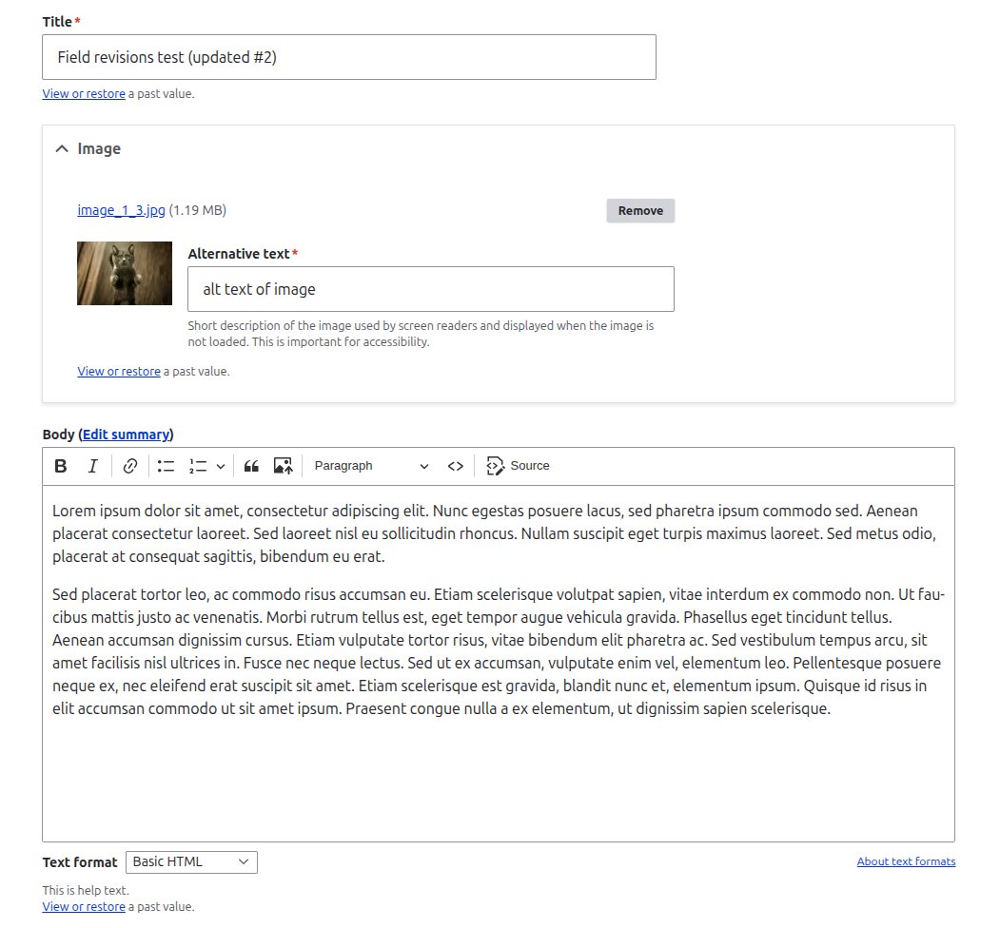
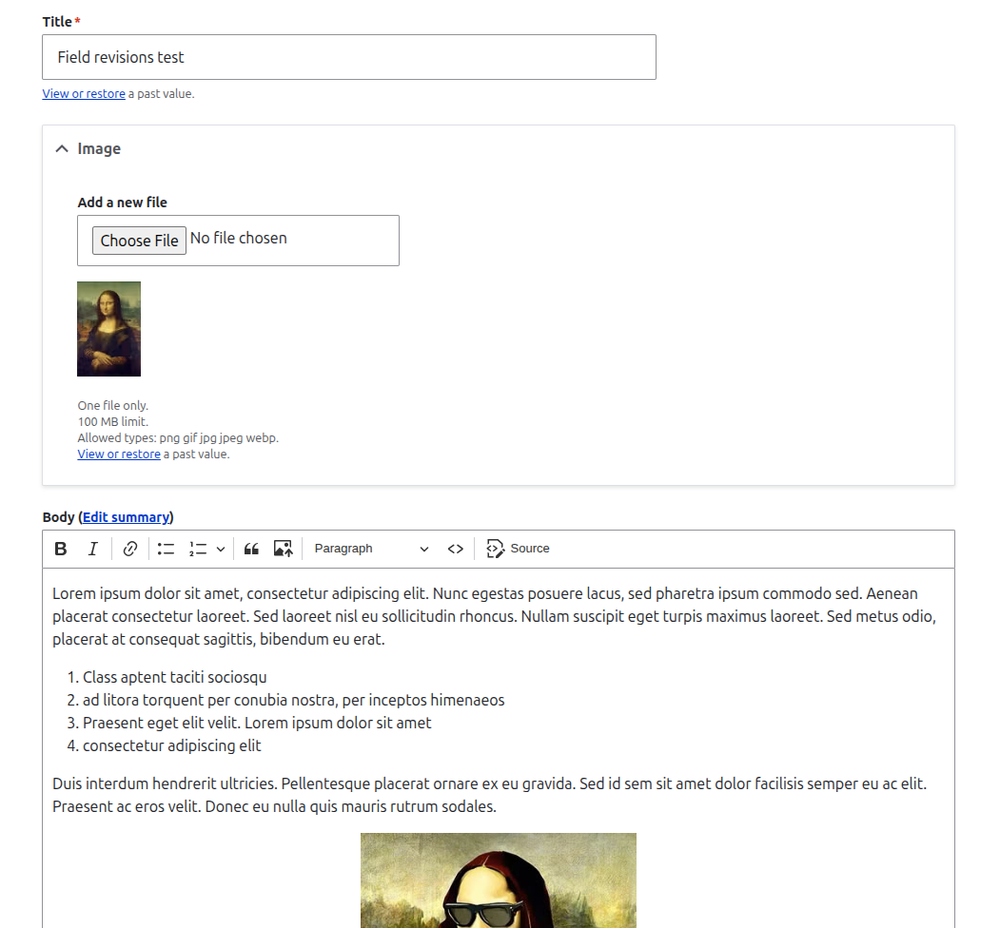
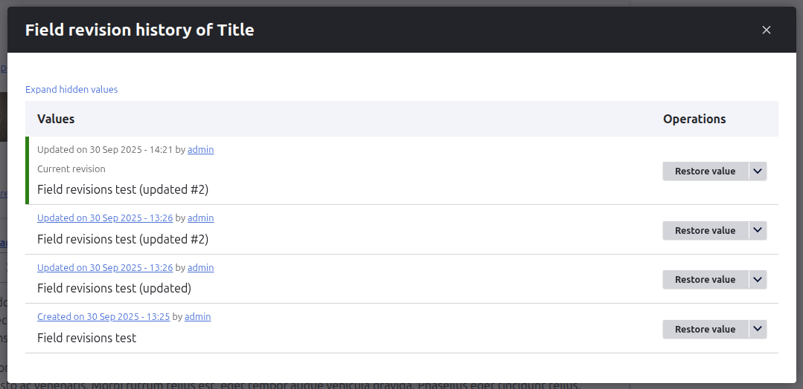
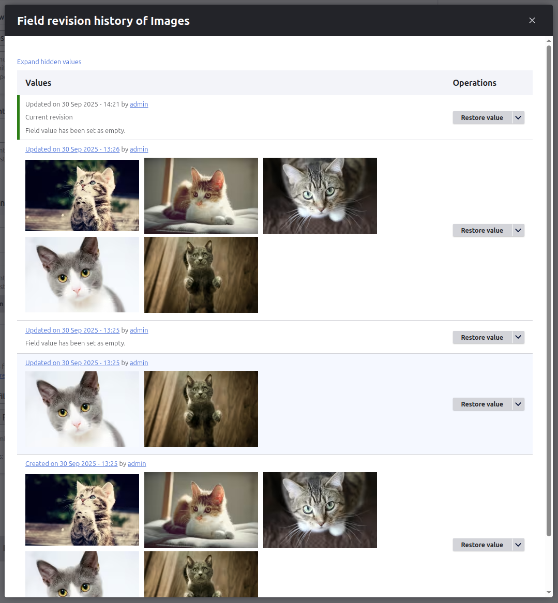
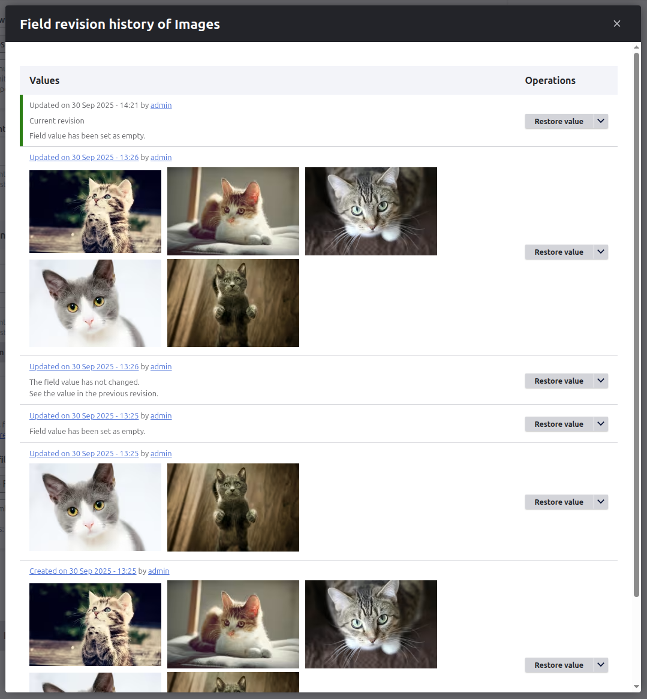
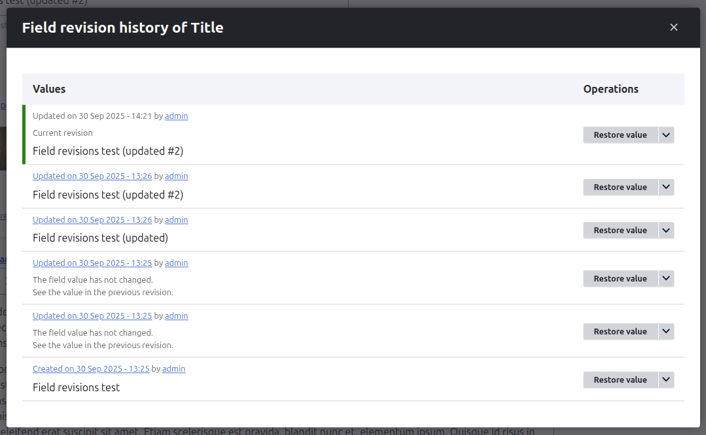
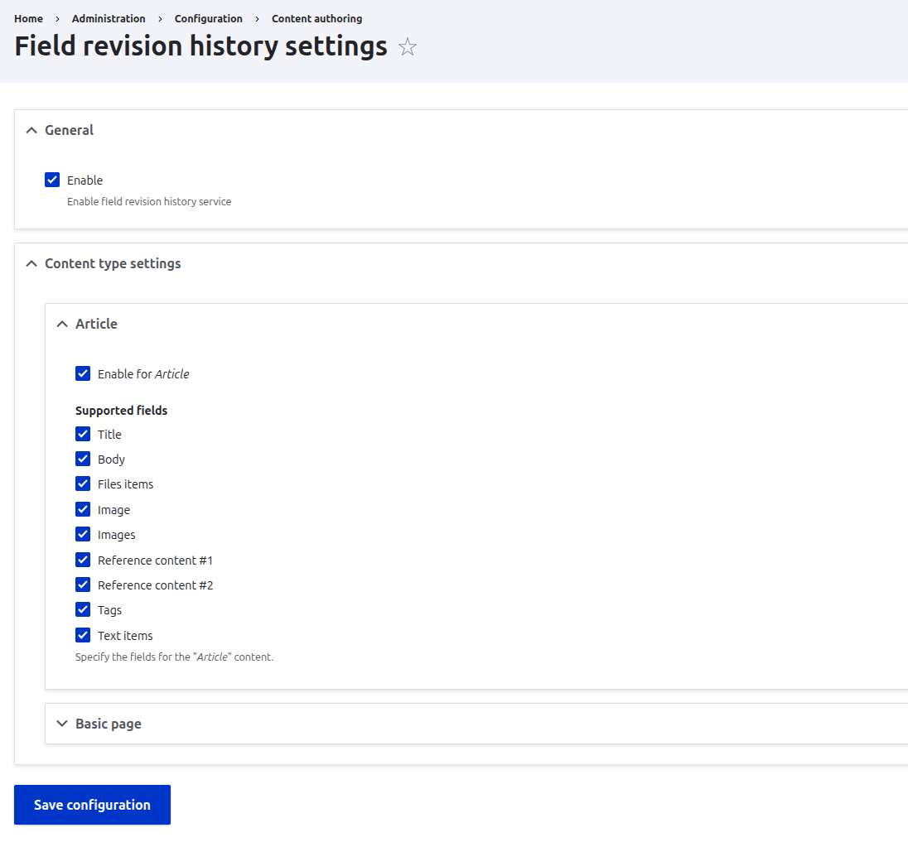

# Field Revision History

A Drupal 11 module that lets editors view and restore past values for individual fields on revisionable content,
without reverting the entire node. It adds a “View or restore a past value” link under configured fields on
node edit forms. Clicking the link opens a modal with the field’s full value history,
including who changed it and when, and allows restoring a specific past value directly into the edit form.

## Key features

- Per-field history modal on node edit forms (for revisionable content types)
- See when a field changed, who changed it, and what the current value is
- One-click “Restore value” to inject a past value into the current edit form (no full node revert)
- Quick links for “View revision” and “Revert revision” alongside each historical record
- Noise reduction: duplicate values are hidden by default; toggle with “Expand hidden values”
- Granular configuration:
  - Enable globally, disable for specific content types
  - Choose exactly which fields the feature applies to per content type
- Access control integrates with core revision permissions plus a dedicated admin permission
- The title field is also supported

## Examples

### Before changes



### After changes


### Some additional examples

Modal with a condensed list where empty/duplicate values are hidden and “Expand hidden values” is shown:




Modal expanded showing all historical values (including previously hidden entries):




## Requirements

- Drupal core 11.x
- Node entities with revisions enabled (per content type)
- Appropriate user permissions to view and/or revert revisions (see “Permissions”)

Note: The module is implemented following Drupal best practices and can be ported to Drupal 9/10 with minimal changes, but the supported target is Drupal 11.

#Installation

Install this module using the standard Drupal module installation process.

## Configuration

Settings form:

**Administration → Configuration → Content authoring → Field Revision History**

```
/admin/config/content/field-revision-history
```



You can configure:
- Global enable/disable toggle.
- Enable/disable per content type.
- Per content type: select the specific fields that should display the “View or restore” link.

**Important:** Ensure the content type is configured to create revisions:

**Structure → Content types → Edit your content type → “Create new revision” is checked.**

## Permissions

The module relies on Drupal core’s revision permissions to gate access to history and revision actions:

- View revisions (e.g., “View all revisions” / “View own unpublished content” as applicable)
- Revert revisions (e.g., “Revert all revisions” or per-content-type equivalents)

Additional module-specific permission:

- administer field revision history configuration — allows access to the module’s settings page

## Usage

- Open a node edit form for a content type that has revisions enabled
- Locate a configured field; you’ll see a link “View or restore”
- Click the link to open the modal with historical values for that field
  - Use “Restore value” to restore field value into your current edit form
  - Use “View revision” to inspect the full node revision (core behavior)
  - Use “Revert revision” to revert the entire node to that revision (core behavior)
- Save the node as usual to persist the restored field value as part of a new revision

Notes:
- Empty and duplicate values are hidden. Click “Expand hidden values” to show them
- If you don’t see the link:
  - Revisions may not be enabled on the content type.
  - Your role may lack the necessary revision permissions.
  - The module or field may be disabled in the module’s settings for that content type.

## How it works

- The module augments node edit forms via form alters for supported fields
- A modal (AJAX-powered) lists past values by traversing the node’s revision history for the specific field
- “Restore value” uses safe form-state manipulation and client-side updates to populate the current form without changing the saved revision until you submit
- “View revision” and “Revert revision” link to core revision routes; permissions are enforced by Drupal core

## Entity and field support

- Entities: nodes only in the initial release
- Fields: aims to work with most standard field types. Rendering and comparison of complex field types may vary

## Troubleshooting
The link does not appear:
- Ensure “Create new revision” is enabled on the content type
  - Verify field is selected in module settings for that content type
  - Check user’s revision-related permissions
- Modal shows limited data:
  - Only revisions where the field changed will display distinct entries
  - Use “Expand hidden values” to show duplicates/empties

## Known limitations
Nodes only (for now).
- Very large revision histories may impact modal load time; consider editorial policies to limit excessive revisions
- Sensitive data: the modal can expose past values; ensure roles and permissions reflect your compliance needs

## Compatibility and updates
Supported: Drupal core 11.x.
- Potential ports: Drupal 9/10 with minimal changes (not officially supported in this repository)
- Follow semver in tagged releases when published

## License
This project is open source and licensed under the GNU General Public License, version 2 or later (GPL-2.0-or-later), the same license used by Drupal core.
You should have received a copy of the GNU GPL along with this program. If not, see https://www.gnu.org/licenses/old-licenses/gpl-2.0.html
